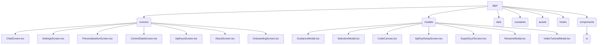

# EyuX: AI Chat & Productivity App

EyuX is a powerful, multi-personality AI chat and productivity app built with Expo and React Native. It offers dynamic AI personalities, live web search, reminders, code execution, file attachments, and more—all in a beautiful, mobile-first experience.

---

## ✨ Features

- **Dynamic Personalities:** Switch between helpful assistant, storyteller, flirty AI, and more.
- **Intelligent Memory:** EyuX remembers key facts about you for a personalized conversation.
- **Effortless Reminders:** Ask the AI to set reminders and get device notifications.
- **Code on the Canvas:** Open, edit, and run code snippets in an interactive environment.
- **Versatile Attachments:** Send images, documents, and files directly in chat.
- **Live Web Search:** Get up-to-the-minute answers and information from the web.
- **Enhanced AI Image Generation:** Generate images with consistent characters.
- **Live Voice & Chat Input:** Use your voice or text to chat with the AI.
- **Access to Higher Models:** Unlock advanced AI models for better responses.
- **Early Access:** Be the first to try new features.

---

## 🛠️ Getting Started

### 1. Prerequisites

- [Node.js](https://nodejs.org/) (v16.17.0 or newer recommended)
- [npm](https://www.npmjs.com/) (comes with Node.js)
- [Expo CLI](https://docs.expo.dev/get-started/installation/) (install globally with `npm install -g expo-cli`)

### 2. Install Dependencies

```bash
npm install
```

This will install all required dependencies listed in `package.json`, including:

<details>
<summary>Click to see all dependencies</summary>

- **Core:** `expo`, `react`, `react-native`, `expo-router`
- **Navigation:** `@react-navigation/native`, `@react-navigation/bottom-tabs`, `@react-navigation/elements`
- **AI & Utilities:** `@google/generative-ai`, `uuid`, `@types/uuid`
- **UI & Media:** `@expo/vector-icons`, `expo-image`, `expo-image-picker`, `expo-blur`, `expo-font`, `expo-haptics`, `expo-status-bar`, `expo-splash-screen`, `expo-symbols`, `expo-system-ui`, `expo-web-browser`, `expo-sharing`, `expo-clipboard`, `expo-file-system`, `expo-document-picker`, `expo-media-library`, `react-native-svg`, `react-native-markdown-display`, `react-native-reanimated`, `react-native-gesture-handler`, `react-native-safe-area-context`, `react-native-screens`, `react-native-webview`
- **Async & Storage:** `@react-native-async-storage/async-storage`
- **Notifications:** `expo-notifications`, `expo-device`, `expo-navigation-bar`
- **Dev:** `expo-dev-client`, `eslint`, `eslint-config-expo`, `typescript`, `@babel/core`, `@types/react`
</details>

### 3. Start the App

```bash
npx expo start
```

You can then open the app in:

- [Expo Go](https://expo.dev/go) (for quick testing)
- Android emulator
- iOS simulator
- A [development build](https://docs.expo.dev/develop/development-builds/introduction/)

### 4. API Keys

Some features (like advanced AI and web search) require API keys. You’ll be prompted in-app to enter these as needed.

---

## 📦 Project Structure

- `app/` — Main app screens and navigation (file-based routing)
- `screens/` — All major screens (chat, settings, onboarding, etc.)
- `modals/` — All modal and popup components
- `components/` — Reusable UI components
- `constants/` — App-wide constants (e.g., colors)
- `hooks/` — Custom React hooks
- `assets/` — Fonts and images

### 📁 Folder/File Structure Diagram



---

## 🧹 Resetting the Project

To reset the app to a blank state, run:

```bash
npm run reset-project
```

- This will move your current `app/`, `components/`, `hooks/`, `constants/`, and `scripts/` directories to `app-example/` (or delete them, based on your choice).
- It then creates a fresh `app/` directory with a starter screen.
- You can safely delete the `app-example/` directory and the `reset-project.js` script after resetting.

---

## 🚀 Building & Deployment (EAS)

This project is EAS-ready. See `eas.json` for build profiles.

- **Install EAS CLI:**  
  ```bash
  npm install -g eas-cli
  ```
- **Build for development:**  
  ```bash
  eas build --profile development --platform all
  ```
- **Build for production:**  
  ```bash
  eas build --profile production --platform all
  ```
- **Submit to app stores:**  
  ```bash
  eas submit --profile production --platform all
  ```

For more, see [Expo EAS documentation](https://docs.expo.dev/eas/).

---

## 🧑‍💻 Useful Scripts

- `npm start` — Start Expo dev server
- `npm run android` — Open on Android emulator/device
- `npm run ios` — Open on iOS simulator/device
- `npm run web` — Run on web
- `npm run lint` — Lint code with ESLint

---

## 📚 Learn More

- [Expo documentation](https://docs.expo.dev/)
- [React Native documentation](https://reactnative.dev/)
- [Learn Expo tutorial](https://docs.expo.dev/tutorial/introduction/)

---

## 💬 Community

- [Expo on GitHub](https://github.com/expo/expo)
- [Expo Discord](https://chat.expo.dev)

---

**Enjoy building with EyuX!**
