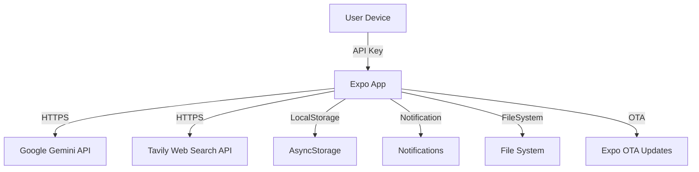

# EyuX: The Supercharged AI Chat Experience

<div align="center">
 

  <br/><br/>
  <strong>A feature-rich, multi-personality AI chat and productivity app built with React Native & Expo.</strong>
  <br/><br/>
  <a href="https://github.com/Eul45/EyuX/stargazers"></a>
  <a href="https://github.com/Eul45/EyuX/network/members"></a>
  <a href="https://github.com/Eul45/EyuX/blob/main/LICENSE"></a>
</div>

---

EyuX is more than just a chatbot. It's a versatile mobile companion designed to be your assistant, entertainer, and productivity partner. Powered by Google's Gemini models, it features dynamic AI personalities, live web search, AI image generation, interactive code execution, long-term memory, and extensive customization options, all wrapped in a sleek, animated, and user-friendly interface.

---
## 🏗️ Project Structure & Architecture

Below is the current project structure, designed for clarity, scalability, and ease of navigation:

```
EYUXBETA
├── app
│   └── (tabs)
│       └── index.tsx             // NOW: A clean entry point that renders the main App component.
├── src
│   ├── api                       // For all external API call logic.
│   │   ├── geminiService.ts
│   │   └── tavilyService.ts
│   ├── assets                    // Stays as is (fonts, images).
│   ├── components                // Reusable UI components.
│   │   ├── animated              // Purely aesthetic animated components.
│   │   │   ├── AnimatedBackground.tsx
│   │   │   └── StarryBackground.tsx
│   │   ├── chat                  // Components specific to the chat screen.
│   │   │   ├── ActiveModeIndicator.tsx
│   │   │   ├── AnimatedChatTitle.tsx
│   │   │   ├── ChatInput.tsx
│   │   │   ├── ImageGenerationPlaceholder.tsx
│   │   │   ├── MessageItem.tsx
│   │   │   ├── SpeechControlToast.tsx
│   │   │   ├── TypingIndicator.tsx
│   │   │   └── WebSearchLoader.tsx
│   │   ├── common                // Generic components used across the app.
│   │   │   ├── CodeBlock.tsx
│   │   │   ├── EyuxLogo.tsx
│   │   │   └── GoSuperEyuxButton.tsx
│   │   ├── modals                // All modal components.
│   │   │   ├── ApiKeyPromptModal.tsx
│   │   │   ├── ChatOptionsMenu.tsx
│   │   │   ├── CodeCanvas.tsx
│   │   │   ├── FoldersScreen.tsx
│   │   │   ├── GuidanceModal.tsx
│   │   │   ├── ImageViewerModal.tsx
│   │   │   ├── MemoriesModal.tsx
│   │   │   ├── MoveToFolderModal.tsx
│   │   │   ├── RenameModal.tsx
│   │   │   ├── SchedulesModal.tsx
│   │   │   ├── SelectionModal.tsx
│   │   │   └── SuperEyuXScreen.tsx
│   │   └── navigation            // Components related to navigation (like the drawer).
│   │       └── Drawer.tsx
│   ├── constants                 // All application constants.
│   │   ├── api.ts
│   │   ├── app.ts
│   │   ├── personalities.ts
│   │   └── storage.ts
│   ├── contexts                  // For React Context providers.
│   │   └── ToastContext.tsx
│   ├── hooks                     // Custom React hooks.
│   │   ├── useNavigationBarStyler.ts
│   │   └── usePrevious.ts
│   ├── screens                   // Top-level screen components.
│   │   ├── ApiKeySetupScreen.tsx
│   │   ├── ChatScreen.tsx
│   │   ├── OnboardingScreen.tsx
│   │   └── SettingsNavigator.tsx   // A new component to manage settings navigation.
│   ├── services                  // Services for managing device features.
│   │   ├── fileService.ts
│   │   ├── notificationService.ts
│   │   └── storageService.ts
│   ├── types                     // Centralized TypeScript types and interfaces.
│   │   └── index.ts
│   ├── utils                     // Helper functions.
│   │   └── systemInstructions.ts
│   └── App.tsx                   // The main application component (formerly AppContent).
├── package.json
└── ... (other root config files)
```

---

### 🔒 Security & Data Flow Overview



---

## ✨ Features Showcase

EyuX is packed with features that create a truly interactive and intelligent chat experience.

<!-- Place a GIF demonstrating the app's key features here -->
<!--  -->

---

## 🧠 Core AI Capabilities

- **🤖 Dynamic Personalities:** Instantly switch the AI's persona—from a helpful Assistant to a chaotic Storyteller, a witty Gen Z, or even an Unhinged AI.
- **🌐 Live Web Search:** The AI automatically detects when it needs fresh information and uses the Tavily API to search the web for real-time events, news, and data.
- **🎨 AI Image Generation:** Generate images directly in the chat by describing what you want to see using the `/imagine` command.
- **💾 Intelligent Memory:** EyuX remembers key facts you share, creating a continuous, personalized conversation. You can also manage these memories manually.
- **⏰ Effortless Reminders:** Set reminders using natural language (e.g., "remind me to check the oven in 10 minutes"), and EyuX will schedule a device notification.
- **🔄 Multi-Model Support:** Switch between different Google Gemini models (e.g., Flash 2.0, Flash 2.5) right from the sidebar to balance speed and power.

---

## 📱 User Experience & Interface

- **🎨 Rich Message Rendering:** Full Markdown support for text formatting, plus beautifully rendered code blocks with syntax highlighting and a one-click copy button.
- **🖼️ Interactive Code Canvas:** When the AI provides web code (HTML/CSS/JS), you can open it in an interactive canvas to edit and run it live in a WebView.
- **📎 Versatile Attachments:** Enhance your prompts by attaching images from your gallery, taking a photo, or uploading documents.
- **🗣️ Text-to-Speech:** Have the AI's responses read aloud with an intuitive speech control bar that shows progress.
- **💅 Deep Customization:** Full Dark & Light Mode support. Personalize chat bubble colors for both you and the AI.
- **✨ Rich Animations:** The UI is full of smooth, delightful animations, from the "Super EyuX" screen transition to the animated chat titles and starry backgrounds.

---

## 🗂️ Organization & Data Management

- **🗂️ Chat Folders:** Organize your conversations into custom folders.
- **🤖 Automatic Organization:** Let the AI automatically categorize new chats into the most relevant folder.
- **💾 Full Backup & Restore:** Export all your chats, folders, settings, and memories to a single JSON file and import it on any device.
- **🔑 Secure API Key Management:** Easily add and update your API keys in a dedicated settings screen.

---

## 🛠️ Tech Stack

- **Framework:** React Native with Expo
- **AI:** Google Generative AI (Gemini) & Tavily AI for Web Search
- **State Management:** React Hooks (useState, useContext, useCallback)
- **Animations:** React Native Reanimated
- **Local Storage:** AsyncStorage
- **UI Components:** @expo/vector-icons, react-native-markdown-display, react-native-webview

---

## 🚀 Getting Started

### 1. Prerequisites

- Node.js (LTS version, v18 or newer recommended)
- npm (comes with Node.js)
- Expo Go app on your iOS or Android device for the quickest setup.

### 2. Clone the Repository

```bash
git clone https://github.com/Eul45/EyuX.git
cd EyuX
```

### 3. Install Dependencies

```bash
npm install
```

### 4. Set Up API Keys

EyuX requires API keys to connect to AI services. You'll need to create a `.env` file to store them securely.

- **Create the file:** In the root of the project, create a new file named `.env`.
- **Get Your Keys:**
  - **Google AI (Gemini):** Go to [Google AI Studio](https://aistudio.google.com/app/apikey) to get your free API key.
  - **Tavily AI (Web Search):** Go to [Tavily.com](https://tavily.com/#api) to get your free API key for the web search feature.
- **Add Keys to .env:**  
  ```env
  EXPO_PUBLIC_GEMINI_API_KEY="YOUR_GOOGLE_AI_API_KEY_HERE"
  EXPO_PUBLIC_TAVILY_API_KEY="YOUR_TAVILY_API_KEY_HERE"
  ```
  > **Note:** The `EXPO_PUBLIC_` prefix is required by Expo to expose these variables to the app.

### 5. Start the Development Server

```bash
npx expo start
```

This will start the Metro bundler. You can then scan the QR code with the Expo Go app on your phone or run the app in an emulator.

---


## 🤝 How to Contribute

Contributions are what make the open-source community such an amazing place to learn, inspire, and create. Any contributions you make are greatly appreciated.

**Key Contribution Areas:**
- **Refactoring:** Help break down large files into smaller, reusable components and screens as outlined in the target architecture.
- **Bug Fixes:** Find and fix bugs to improve stability.
- **New Features:** Propose and implement new, exciting features.
- **Performance Optimization:** Help improve app startup time and responsiveness.

**Steps:**
1. Fork the Project
2. Create your Feature Branch (`git checkout -b feature/AmazingFeature`)
3. Commit your Changes (`git commit -m 'Add some AmazingFeature'`)
4. Push to the Branch (`git push origin feature/AmazingFeature`)
5. Open a Pull Request

---


---

## 🙏 Acknowledgments

- Expo Team for their incredible tools and platform.
- Google for the powerful Gemini models.
- Tavily for the excellent search API.
- All the creators of the open-source libraries used in this project.

<div align="center">
  <strong>&lt;/&gt; Made by Eyuel Engida</strong>
</div>


---
